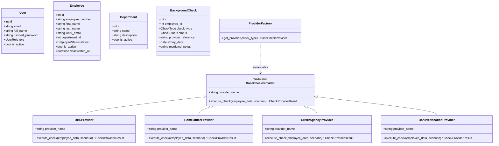

# Backend Class Diagram

```mermaid
classDiagram
    class User {
        +int id
        +string email
        +string full_name
        +string hashed_password
        +UserRole role
        +bool is_active
    }

    class Employee {
        +int id
        +string employee_number
        +string first_name
        +string last_name
        +string work_email
        +int department_id
        +EmployeeStatus status
        +bool is_active
        +datetime deactivated_at
    }

    class Department {
        +int id
        +string name
        +string description
        +bool is_active
    }

    class BackgroundCheck {
        +int id
        +int employee_id
        +CheckType check_type
        +CheckStatus status
        +string provider_reference
        +date expiry_date
        +string restricted_notes
    }

    class BaseCheckProvider {
        <<abstract>>
        +string provider_name
        +execute_check(employee_data, scenario) CheckProviderResult
    }

    class DBSProvider {
        +string provider_name
        +execute_check(employee_data, scenario) CheckProviderResult
    }

    class HomeOfficeProvider {
        +string provider_name
        +execute_check(employee_data, scenario) CheckProviderResult
    }

    class CreditAgencyProvider {
        +string provider_name
        +execute_check(employee_data, scenario) CheckProviderResult
    }

    class BankVerificationProvider {
        +string provider_name
        +execute_check(employee_data, scenario) CheckProviderResult
    }

    class ProviderFactory {
        +get_provider(check_type) BaseCheckProvider
    }

    BaseCheckProvider <|-- DBSProvider
    BaseCheckProvider <|-- HomeOfficeProvider
    BaseCheckProvider <|-- CreditAgencyProvider
    BaseCheckProvider <|-- BankVerificationProvider
    ProviderFactory ..> BaseCheckProvider : instantiates
```
