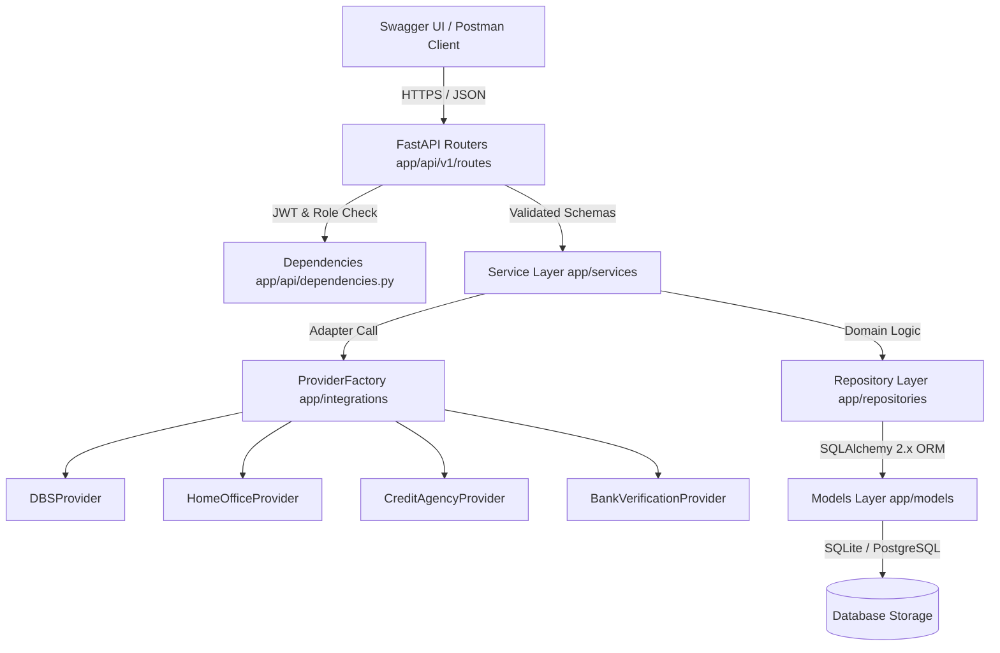

# Component Architecture Diagram

```mermaid
graph TD
    Client[Swagger UI / Postman Client] -->|HTTPS / JSON| API[FastAPI Routers app/api/v1/routes]
    API -->|JWT & Role Check| AuthDep[Dependencies app/api/dependencies.py]
    API -->|Validated Schemas| Services[Service Layer app/services]
    Services -->|Domain Logic| Repos[Repository Layer app/repositories]
    Services -->|Adapter Call| Factory[ProviderFactory app/integrations]
    Factory --> DBS[DBSProvider]
    Factory --> HO[HomeOfficeProvider]
    Factory --> Credit[CreditAgencyProvider]
    Factory --> Bank[BankVerificationProvider]
    Repos -->|SQLAlchemy 2.x ORM| Models[Models Layer app/models]
    Models -->|SQLite / PostgreSQL| DB[(Database Storage)]
```
