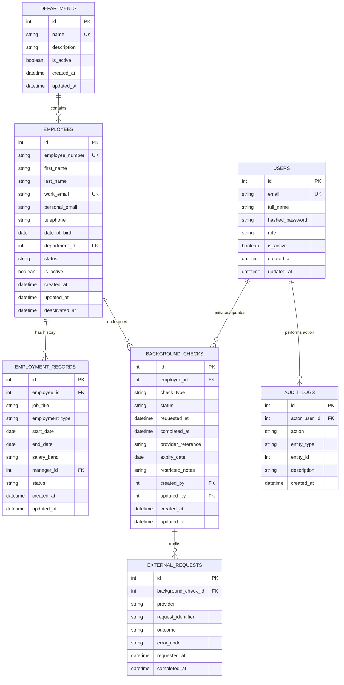

# Database Entity-Relationship (ER) Diagram



## Exporting Diagram Instructions
To export this diagram as PNG or SVG:
1. Open this file in VS Code or GitHub with Mermaid rendering enabled.
2. Use `mmdc` (Mermaid CLI) command:
   ```bash
   npx @mermaid-js/mermaid-cli -i docs/diagrams/er-diagram.md -o docs/diagrams/er-diagram.png
   ```
